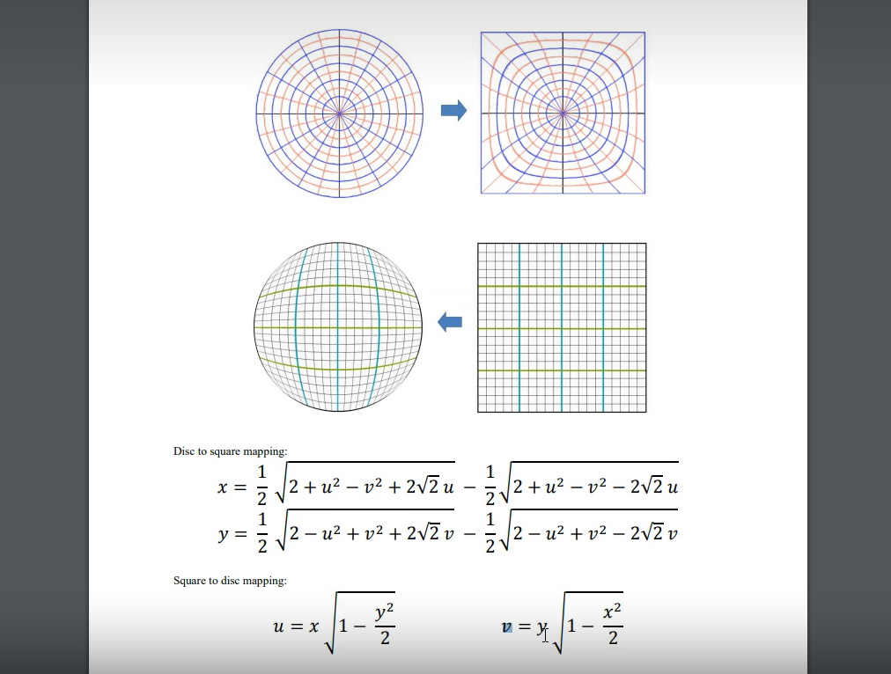
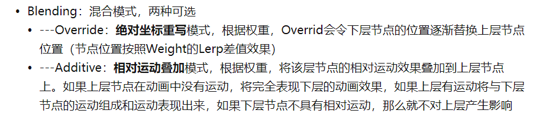
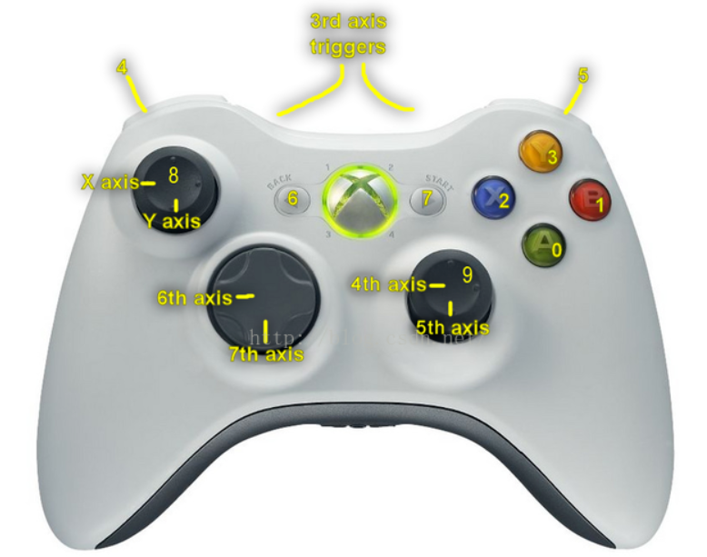
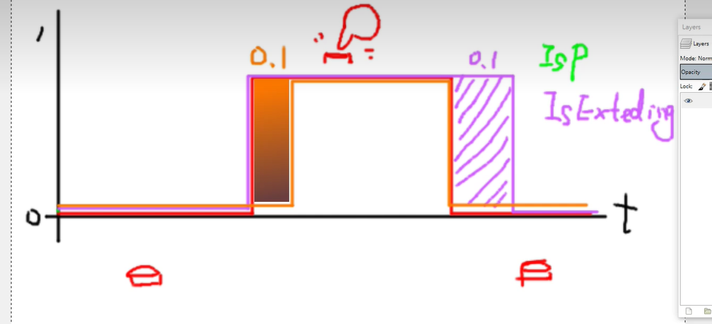
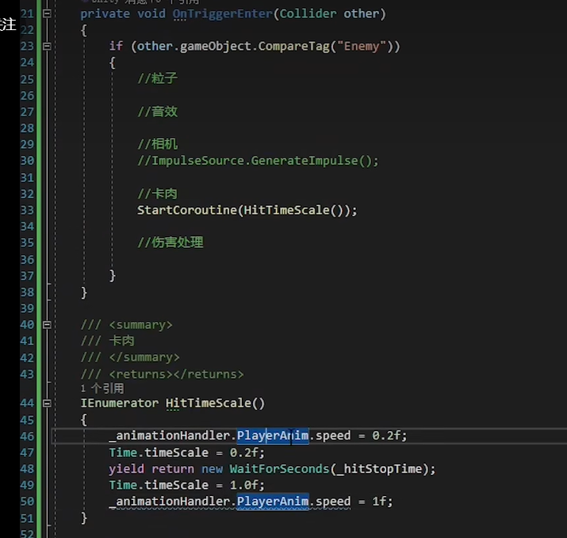

# 前言

随便记录，想到什么写什么，不保证具有参考价值

# 进度

[教程](https://www.bilibili.com/video/BV1gW411T7yb?p=5&spm_id_from=pageDriver&vd_source=cb4ad3dd3ef3ca9c2b272f8b9b57aafd)

2022年4月8日02点40分 建文件夹

2022年7月21日01点59分 捡起来 之前看完 P7 ，先复习一下前面的

2022年7月22日03点05分 结束P8

2022年8月17日21点52分 复健，更新进度为P19结尾

2022年9月7日03点41分 更新进度为P21结尾

2022年10月11日02点30分 更新进度为P25开头

2022.12.21 re

2022.12.25 1300 P41尾

2023.1.11 06点07分 第一季结束！

# 笔记

## 输入

将键盘输入或手柄输入转化为虚拟信号，方便后续自定义键位。经典中间层。

多键位要考虑键位冲突的情况，最好放在 ctrl 或 shift 上 

## 软关闭

在想要取消某个脚本的功能但是不想丢失脚本数据的情况下可以软关闭，通过在脚本上添加一个 bool 来在代码中人为取消脚本的功能。

## 代码规范

尽量在 Awake 里初始化组件（为什么我还要记这种）

如果是用常量和变量进行是否相等的判断时，建议可以把常量写在 = 前，因为一个=是赋值，是一个从右向左的过程，但是常量肯定是无法被重复赋值的，所以 IDE 和编译器肯定会报错。否则会认为这是一个成功的赋值行为，返回的肯定是true

动画机参数大写开头

## 动画混合树

柔和多个动画，一定程度上减少蜘蛛网的存在。

另外可以让动画之间的切换平滑不突兀。

## 插值

Lerp 和 Slerp 线性和球形的差别，前者为两点相连，后者为两点中心画圆，具体见灵感-跟随

## 椭圆映射法

防止出现斜向跑路1.414的问题

## 动画切换

在动画切换过程中如果再次发生切换会导致动画不和谐，通过修改切换的

interruption source 为 current state

P22

## RootMotion

研究了半天，为什么攻击动画的root motion读不到？到底神魔问题

[Unity 动画系列四 代码控制动画实例 和 RootMotion ](https://www.jianshu.com/p/35f9f86e03b5)

[Unity开发：RootMotion详解](https://zhuanlan.zhihu.com/p/428251577)

[【Unity动画系统】汇总篇](https://zhuanlan.zhihu.com/p/492136094)

阿阿阿阿阿阿 历时两天 终于修好了

原因就是attack层的动画选错了混合方式，但是到底是为什么呢？

## Xbox手柄键位

[【xbox开发】unity3d xbox one手柄键位](https://blog.csdn.net/egostudio/article/details/51463774?utm_source=blogxgwz0)

【按钮】
A = joystick button 0
B = joystick button 1
X = joystick button 2
Y = joystick button 3  
LB = joystick button 4
RB = joystick button 5
Back = joystick button 6
Home = joystick button 7
Left analog press = joystick button 8（左摇杆按下）
Right analog press = joystick button 9（右摇杆按下）

【轴】
Left analog X = X axis（左摇杆X）
Left analog Y = Y axis（左摇杆Y）
LT/RT = 3rd axis
Right analog X = 4th axis（右摇杆X）
Right analog Y = 5th axis（右摇杆Y）
Dpad X = 6th axis
Dpad Y = 7th axis

## UpdateMode

用了root motion，最好把模型的update mode 改成 animate physics

## Layer

武器单独一层 不予地面碰撞

之后技能特效又该如何？

## 空气墙特效

[【Shader Graph】Unity中如何实现边界限制的空气墙效果](https://www.bilibili.com/video/BV1xP4y1B7ED)

## 镜面效果

[Unity 3D用简单的Cube、Sphere实现镜面/哈哈镜效果](https://blog.csdn.net/ChinarCSDN/article/details/80210924)

## Timer

# 素材

用到的一些素材

由于太懒了 之后一起整合一下

## 商店

boxophobic

## 教程

黑魂包

空气墙包

# 灵感

记录一些灵机一动的想法，可以说是TODO列表，也可以说是坑

## 跟随

vector3.lerp(item.position,targetitem.position,time.deltatime*multiple)

这不来个御剑，很难过得去啊

[来源](https://www.bilibili.com/video/BV14x411y7iY?from=search&seid=6845152375471059956&spm_id_from=333.337.0.0&vd_source=cb4ad3dd3ef3ca9c2b272f8b9b57aafd)

## 卡肉

武器碰撞逻辑代码

[在Unity中实现卡肉卡帧及动画事件的思路](https://www.bilibili.com/video/BV1ge41137mM)

## 打击感

2022.12.6	https://www.bilibili.com/video/BV1fR4y1y7vT

## 捡东西

2022.12.6	https://www.bilibili.com/video/BV1C14y1n7wR

# 教程链接

[[傅老師/Unity教學][4/27中午更新] DarkSouls複刻經典教程#第一季](https://www.bilibili.com/video/BV1gW411T7yb)

